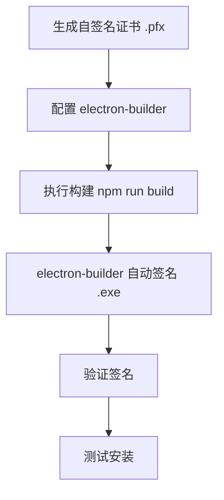

# Windows 自签名证书实验指南

> 用自签名证书走通整个签名流程，理解每个环节后再购买正式证书。  
> ⚠️ 自签名证书仅用于**本地测试**，无法消除 SmartScreen 警告。

---

## 整体流程



---

## 第一步：生成自签名证书

在 Windows 上打开 **PowerShell（管理员）**，执行以下命令：

```powershell
# 生成自签名代码签名证书
$cert = New-SelfSignedCertificate `
  -Type CodeSigningCert `
  -Subject "CN=My Test Company, O=My Test Org" `
  -KeyAlgorithm RSA `
  -KeyLength 2048 `
  -HashAlgorithm SHA256 `
  -CertStoreLocation "Cert:\CurrentUser\My" `
  -NotAfter (Get-Date).AddYears(3)

# 查看生成的证书
echo "✅ 证书已生成！"
echo "证书指纹 (Thumbprint): $($cert.Thumbprint)"
echo "证书主题: $($cert.Subject)"
```

然后**导出为 .pfx 文件**（electron-builder 需要用到）：

```powershell
# 设置 .pfx 密码
$password = ConvertTo-SecureString -String "test123" -Force -AsPlainText

# 导出证书为 .pfx 文件
Export-PfxCertificate `
  -Cert "Cert:\CurrentUser\My\$($cert.Thumbprint)" `
  -FilePath "$HOME\Desktop\test-cert.pfx" `
  -Password $password

echo "✅ 证书已导出到桌面: test-cert.pfx"
echo "📌 密码是: test123"
```

> 执行完后你会在桌面得到一个 `test-cert.pfx` 文件。

---

## 第二步：验证证书已安装

```powershell
# 查看刚才生成的证书
Get-ChildItem Cert:\CurrentUser\My -CodeSigningCert | Format-Table Subject, Thumbprint, NotAfter
```

预期输出类似：

```
Subject                              Thumbprint                               NotAfter
-------                              ----------                               --------
CN=My Test Company, O=My Test Org    ABC123DEF456...                          2029/2/11
```

---

## 第三步：配置项目

### 方式一：使用环境变量（推荐）

electron-builder 会**自动读取**以下两个环境变量：

```powershell
# PowerShell 中设置环境变量（当前会话有效）
$env:CSC_LINK = "$HOME\Desktop\test-cert.pfx"
$env:CSC_KEY_PASSWORD = "test123"
```

你的 `electron-builder.json5` **不需要做任何改动**，electron-builder 会自动用这个证书签名。

### 方式二：创建 .env 文件

在项目根目录创建 `.env` 文件：

```bash
# .env（记得加入 .gitignore！）
CSC_LINK=C:\Users\你的用户名\Desktop\test-cert.pfx
CSC_KEY_PASSWORD=test123
```

> 💡 `CSC_LINK` 也支持直接写 Base64 编码的证书内容，但测试阶段用文件路径更直观。

---

## 第四步：执行构建

```powershell
# 确保在项目目录下
cd wx-electron-counter

# 安装依赖（如果还没装）
npm install

# 构建（会自动签名）
npm run build
```

构建日志中会出现类似以下内容，说明签名成功：

```
  • signing         file=release\0.0.0\YourAppName-Windows-0.0.0-Setup.exe
                    certificateFile=C:\Users\xxx\Desktop\test-cert.pfx
  • building        target=nsis file=release\0.0.0\YourAppName-Windows-0.0.0-Setup.exe
```

---

## 第五步：验证签名

### 5.1 命令行验证

```powershell
# 使用 signtool 验证（需要安装 Windows SDK）
signtool verify /pa /v "release\0.0.0\YourAppName-Windows-0.0.0-Setup.exe"

# 使用 PowerShell 验证
Get-AuthenticodeSignature "release\0.0.0\YourAppName-Windows-0.0.0-Setup.exe"
```

> ⚠️ 自签名证书验证会显示 `UnknownError` 或 `A certificate chain could not be built`，
> 这是**正常的** — 因为你的证书不是受信任的 CA 签发的。

### 5.2 图形界面验证

1. **右键** 生成的 `.exe` 文件 → **属性**
2. 切换到 **数字签名** 标签页
3. 应该能看到签名信息：

```
签名者名称: My Test Company
时间戳:      （可能为空，自签名不一定有时间戳）
```

4. 双击签名 → **详细信息** → 可以查看证书链

### 5.3 安装测试

双击运行 `.exe` 安装包：

- ✅ 应该会弹出安装界面
- ⚠️ **会显示 SmartScreen 警告**（"Windows 已保护你的电脑"），这是正常的
- 点击 **"更多信息" → "仍要运行"** 继续安装
- 安装完成后正常运行应用

---

## 第六步（可选）：信任自签名证书

如果你想在**本机**消除安全警告（仅开发测试用）：

```powershell
# 将自签名证书添加到"受信任的根证书颁发机构"
# ⚠️ 仅影响本机，其他电脑仍然会警告

# 获取证书指纹（替换为你实际的指纹）
$thumbprint = "你的证书指纹"

# 导出证书（仅公钥）
Export-Certificate `
  -Cert "Cert:\CurrentUser\My\$thumbprint" `
  -FilePath "$HOME\Desktop\test-cert.cer"

# 导入到受信任的根证书存储（需要管理员权限）
Import-Certificate `
  -FilePath "$HOME\Desktop\test-cert.cer" `
  -CertStoreLocation "Cert:\LocalMachine\Root"

echo "✅ 证书已添加到受信任的根证书颁发机构"
```

> 添加后在本机验证签名会显示 `Valid`，安装时也不会有警告。  
> ⚠️ **测试完记得清理**：打开 `certmgr.msc` → 受信任的根证书颁发机构 → 找到并删除。

---

## 自签名 vs 正式证书 的区别总结

| 环节 | 自签名证书 | 正式 OV/EV 证书 |
|------|-----------|----------------|
| 生成方式 | PowerShell 一行命令 | CA 机构购买 + 身份验证 |
| 签名过程 | ✅ 完全相同 | ✅ 完全相同 |
| 签名验证 | ⚠️ 显示不受信任 | ✅ 显示有效签名 |
| SmartScreen | 🔴 始终警告 | 🟡 OV 需积累声誉 / 🟢 EV 立即通过 |
| 用户体验 | "未知发布者" | 显示公司名称 |
| CI/CD 流程 | ✅ 完全相同 | ✅ 完全相同 |

> 💡 **关键点：** 除了证书来源不同，整个签名流程（配置 → 构建 → 签名 → 验证）是**完全一样的**。
> 所以用自签名证书跑通一遍后，换成正式证书只需要替换 `.pfx` 文件和密码即可。

---

## 清理（测试完成后）

```powershell
# 删除自签名证书
$thumbprint = "你的证书指纹"
Remove-Item "Cert:\CurrentUser\My\$thumbprint"

# 删除 .pfx 文件
Remove-Item "$HOME\Desktop\test-cert.pfx"

# 如果添加了受信任根证书，也记得清理
# certmgr.msc → 受信任的根证书颁发机构 → 找到并删除
```
